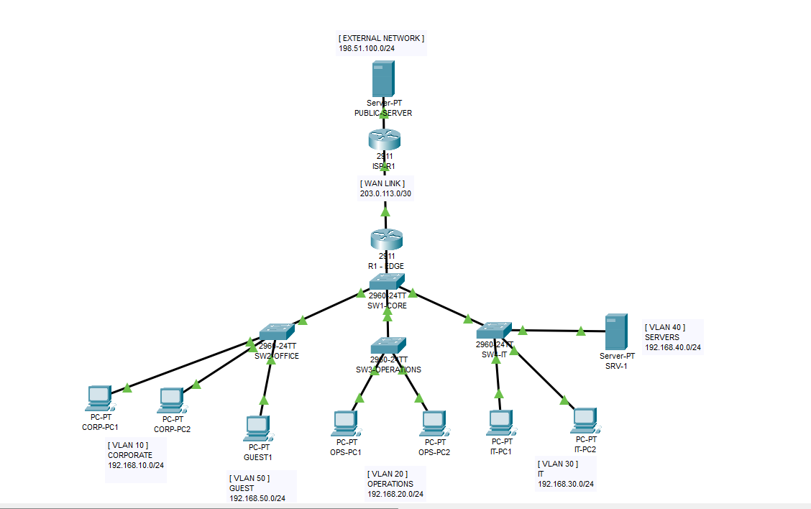
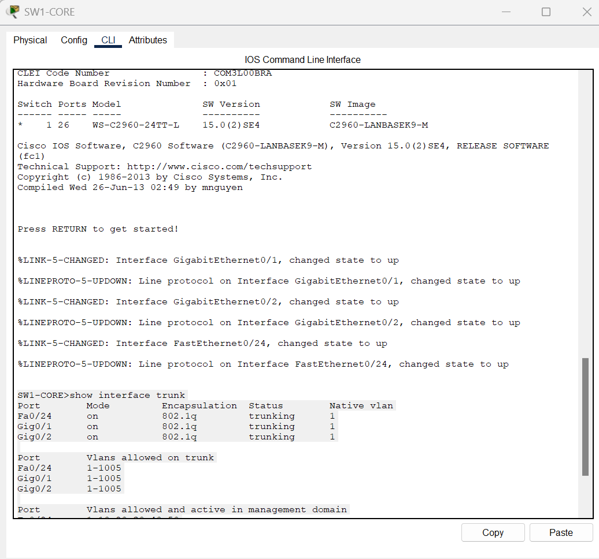
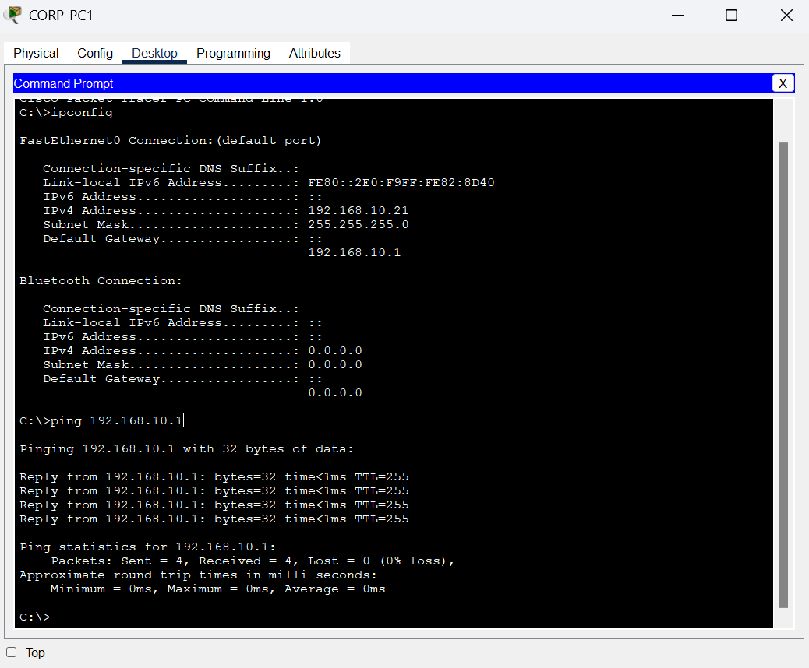
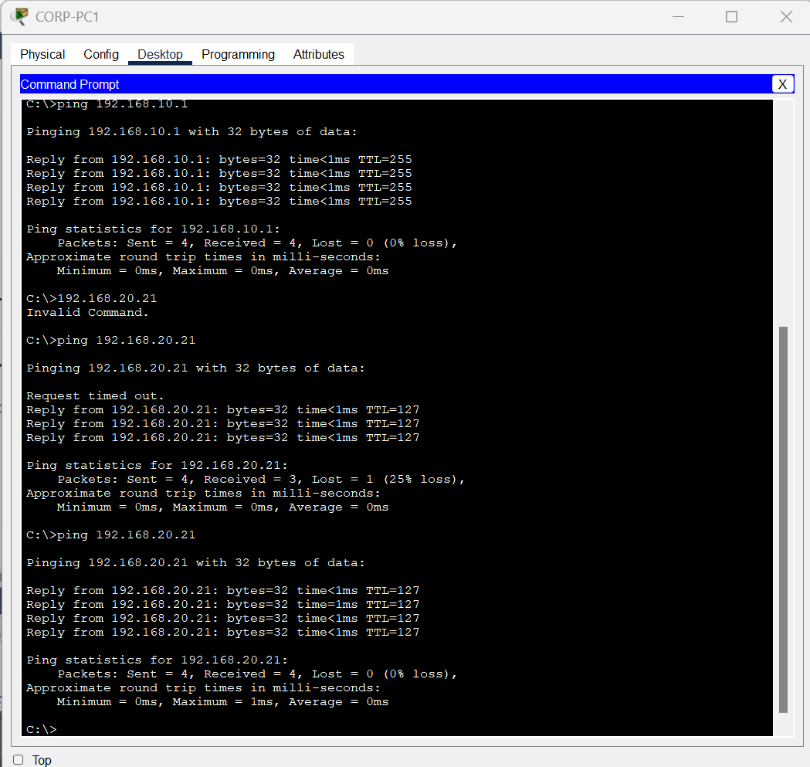
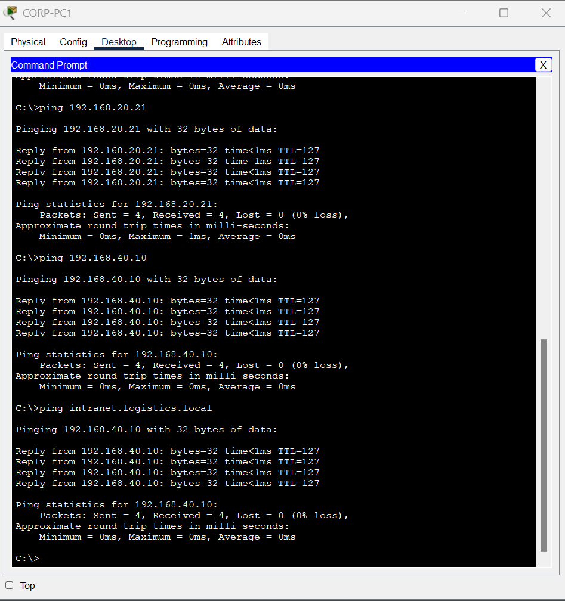
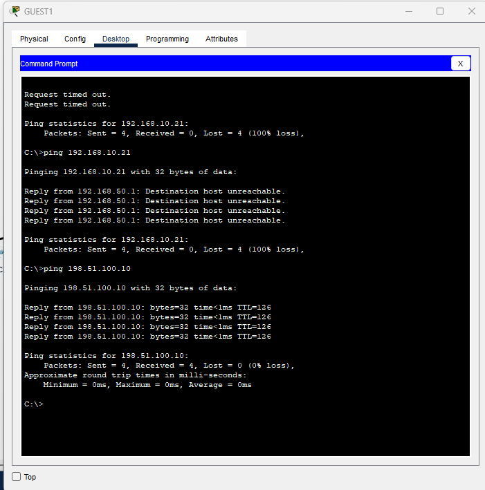
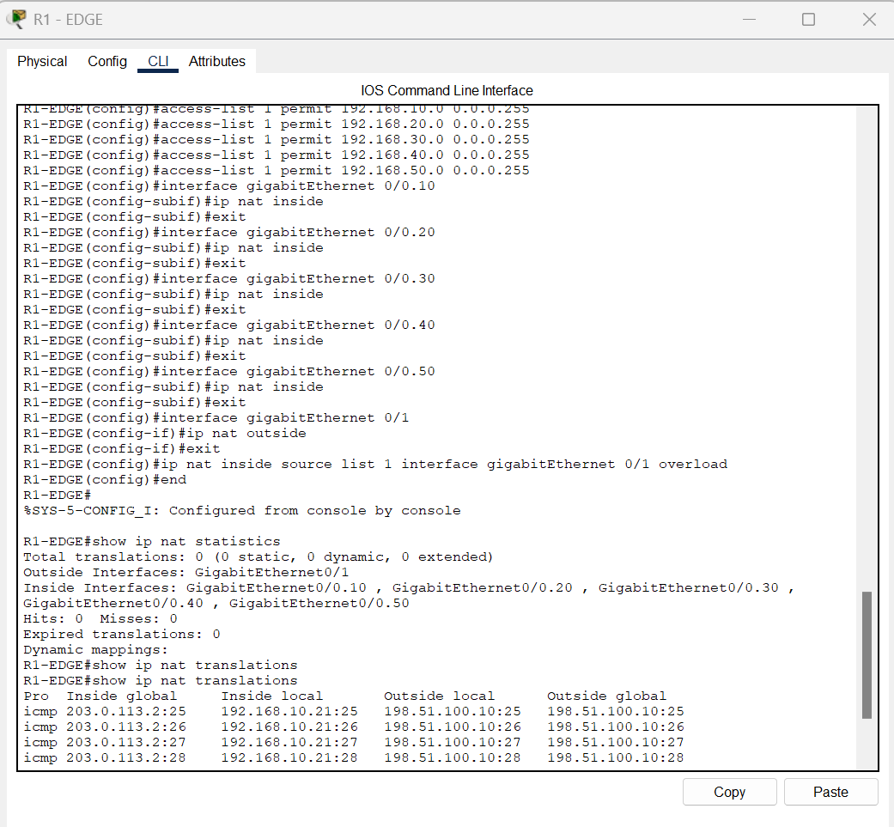
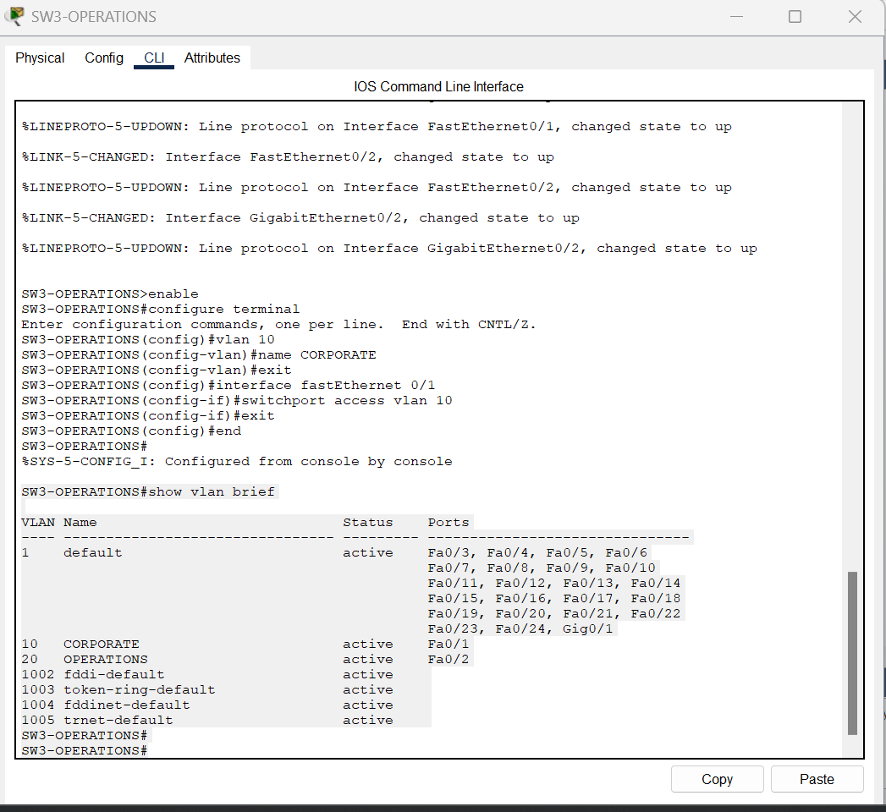
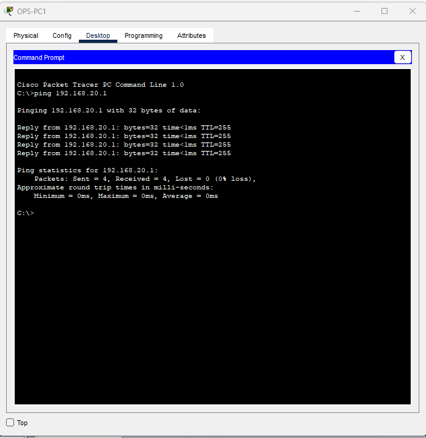

# Enterprise Network Infrastructure Simulation

A hands-on enterprise network simulation built in Cisco Packet Tracer to practise network segmentation, routing, switching, network services, security controls, NAT/PAT, and troubleshooting.

The network represents a small organisation with separate Corporate, Operations, IT, Server, and Guest networks connected through a core switching architecture and an edge router to a simulated external network.

## Network Architecture

The topology uses a hierarchical design consisting of:

- Core switch connecting departmental access switches
- IEEE 802.1Q trunk links between switches
- Router-on-a-stick for inter-VLAN routing
- Separate VLANs for Corporate, Operations, IT, Servers, and Guests
- Centralised DHCP services
- Internal DNS service
- ACL-based Guest network isolation
- NAT/PAT for external network connectivity
- Simulated ISP and public server

## VLAN and IP Addressing

| VLAN | Department | Network | Default Gateway |
|------|------------|---------|-----------------|
| 10 | Corporate | 192.168.10.0/24 | 192.168.10.1 |
| 20 | Operations | 192.168.20.0/24 | 192.168.20.1 |
| 30 | IT | 192.168.30.0/24 | 192.168.30.1 |
| 40 | Servers | 192.168.40.0/24 | 192.168.40.1 |
| 50 | Guest | 192.168.50.0/24 | 192.168.50.1 |

Additional networks:

- WAN link: `203.0.113.0/30`
- Simulated external network: `198.51.100.0/24`
- Internal DNS server: `192.168.40.10`

## Key Implementations

### VLAN Segmentation and Trunking

Departmental devices were separated into dedicated VLANs. IEEE 802.1Q trunk links were configured between the core and access switches to carry multiple VLANs across the switching infrastructure.

Core trunk configuration was verified through the Cisco IOS CLI.

### DHCP and Corporate Connectivity

DHCP pools were configured to dynamically provide IPv4 addressing, subnet masks, default gateways, and DNS information to client devices.

Corporate client configuration and gateway connectivity were verified after DHCP assignment.

### Inter-VLAN Routing

Router-on-a-stick was configured on the edge router using subinterfaces for VLANs 10, 20, 30, 40, and 50.

Connectivity testing confirmed successful communication between authorised internal VLANs.

### DNS

An internal DNS service was configured and tested using the hostname:

`intranet.logistics.local`

The hostname successfully resolved to the internal server at `192.168.40.10`.

### Guest Network Security

An extended ACL was implemented to restrict devices in VLAN 50 from accessing the Corporate, Operations, IT, and Server networks while still permitting access to the simulated external network.

During final validation, Guest network isolation was confirmed while external connectivity remained available.

### NAT/PAT

NAT overload (PAT) was configured on the edge router to translate internal private IPv4 addresses to the WAN interface address for external connectivity.

The NAT translation table confirmed traffic from the internal host `192.168.10.21` being translated to the WAN address `203.0.113.2` when communicating with the simulated external network.

## Troubleshooting Exercises

### Intentional VLAN Misconfiguration

A controlled VLAN misconfiguration was intentionally introduced on the Operations access switch by assigning the OPS-PC1 switch port to VLAN 10 instead of its correct VLAN 20.

The configuration issue was identified using:

`show vlan brief`

The affected switch port was then reassigned to VLAN 20 and connectivity to the Operations gateway was successfully restored.

### Guest DHCP and ACL Troubleshooting

During final validation, the Guest client received an APIPA address instead of an address from the `192.168.50.0/24` network.

The DHCP bindings and Guest ACL were reviewed. A DHCP exception was added before the Guest network restriction rules so that DHCP client-to-server traffic could occur while maintaining isolation from internal networks.

Final testing confirmed:

- Guest DHCP addressing: Successful
- Guest → Corporate: Blocked
- Guest → External network: Allowed

The final Guest isolation and external connectivity test is shown below.

## Validation

The completed network was tested for:

- VLAN membership
- IEEE 802.1Q trunk operation
- DHCP address assignment
- Default gateway connectivity
- Inter-VLAN routing
- Internal DNS resolution
- Guest network isolation
- External network connectivity
- NAT/PAT translation
- Recovery from an intentional VLAN configuration fault
- DHCP and ACL troubleshooting

Supporting implementation and validation evidence is available in the [`screenshots`](screenshots/) directory.

## Tools and Technologies

- Cisco Packet Tracer
- Cisco IOS CLI
- Ethernet Switching
- IEEE 802.1Q
- VLANs
- IPv4
- Subnetting
- DHCP
- DNS
- Router-on-a-Stick
- Inter-VLAN Routing
- Access Control Lists (ACLs)
- NAT/PAT
- ICMP
- Network Troubleshooting

## Project File

The complete Cisco Packet Tracer topology and device configurations are available in:

`enterprise-network-infrastructure-simulation.pkt`

The file can be opened using Cisco Packet Tracer to inspect the topology, device configurations, addressing scheme, and network behaviour.

## Learning Outcomes

This project provided practical experience in designing and configuring a segmented enterprise-style network, validating end-to-end connectivity, implementing basic network security policies, and troubleshooting Layer 2 and Layer 3 connectivity issues.

It strengthened my understanding of how switching, VLANs, routing, DHCP, DNS, ACLs, and NAT/PAT work together within a network infrastructure and provided hands-on experience using Cisco IOS commands to configure, verify, and troubleshoot network services.
